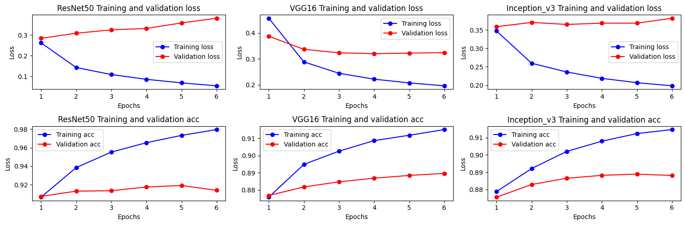

# mlabel_img_classification

This project is a multi-label image classification in computer
vision. One image can have multiple identifiable objects and the task
is to train a model to identify these objects.

The project was implemented using the PyTorch framework in particular
version *PyTorch version 2.0.0+cu117*, a more comprehensive
requirements.txt can be found in the repo.

## Data

The dataset used contains 20000 images and their annotations which are
stored in *images* and *annotations* folder respectively. Annotations
are contained in text files named by *<classname>.txt*. The annotations
folder contains 14 files which implies that an image can have upto 14
labels.

An example of image files in the image directory
```
ls images | head
im10000.jpg
im10001.jpg
im10002.jpg
...
```

An example of annotation files
```
baby.txt
bird.txt
car.txt
...
```
An example of contents in an annotation file
```
$cat annotations/car.txt | head
18077
13634
16466
...
```

### Data processing

We need to create a data class that will be used to create dataloaders
for training an validation purposes. For this purpose we create a
custom dataset class by inheriting the data.Dataset object in
torch. Typically, we need to implement(overide) the __init__, __len__
and __getitem__ functions of the parent class.

Because of the multiple labels per image, we need to create a
multi-hot encoded label for an image. The resulting data

## Methodology

Transfer learning was used as the training approach, this would help
avoid a cold start and improve training efficiency. Three models were
tested: ResNet60, VGG16 and Inception_v3.

First attempt based on only training the fully connected layers: Model
tends to overfitt as we note that the validation loss is lower than
the training loss and the validation accuracy is higher tnan the
training accuracy.

Second approach, we allow for more layers to update their parameters
and this improves the results as the training loss is now lower than
the validation loss and the accuracy of the training is higher than
the accuracy of the validation set, this is atleast the expected
behaviour.

## Results
Latest results from training process 

Based on the validation and accuracy curves, ResNet50 and Inception_V3
appear to be overfitting but the VGG16 is not overfitting. Probably
the regularization parameter settings should be different for each
model.

Key hyperparameter settings, all models have weight decay set at
0.0001, Resnet50 and Inception have a dropout of 40% while VGG16 does
not have dropout applied.



## ToDo List
- [x] Model initialization using pretrained weights is generating a warning
  because Pretrained=True # is depricated, need to use suggested
  approach

- [x] Refactor the code to move the model creation out of the training
  loop so multiple models can be supported in a much cleaner manner

- [x] Update the mechanism to store predictions(json files) so that each
  model can store its results without manually changing the names

- [ ] Upload results from all models

- [ ] Generate a requirements.txt file for the project

- [ ] Create a single data class that splits the training and
  validation dataset internally.

- [ ] Implement distrubuted training to speed up the training time